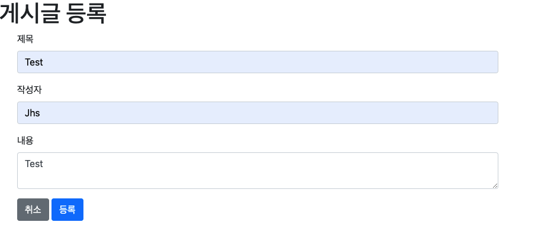
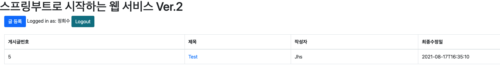
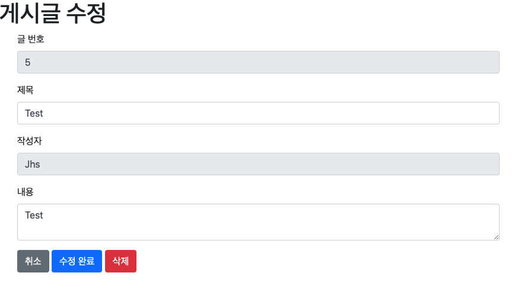

# 스프링 부트와 AWS로 혼자 구현하는 웹 서비스
스프링부트 + JPA로 게시판 기능(로그인, 글 등록, 수정, 삭제)구현. 프로젝트는 AWS로 배포 자동화 시스템 구축 

## Description
 
게시판 구현

- 게시글 등록 및 수정, 삭제 서비스

Database

-  h2 database, JPA로 생성 및 수정 시간 자동화

View 구현

- Mustache, Thymeleaf로 뷰 템플릿 구현

로그인 기능 구현

-  구글 및 네이버의 API 등록하여 로그인 서비스 구현

AWS로 배포

-  AWS 서버 환경(ec2) 및 데이터베이스(rds) 환경 구축

- AWS EC2 인스턴스로 프로젝트 배포
- 비용 문제로 인하여 12:00 ~ 18:00 배포

## Images
    게시글 등록 페이지

    게시글 등록 후 Main 페이지

    게시글 수정 및 삭제 페이지

---